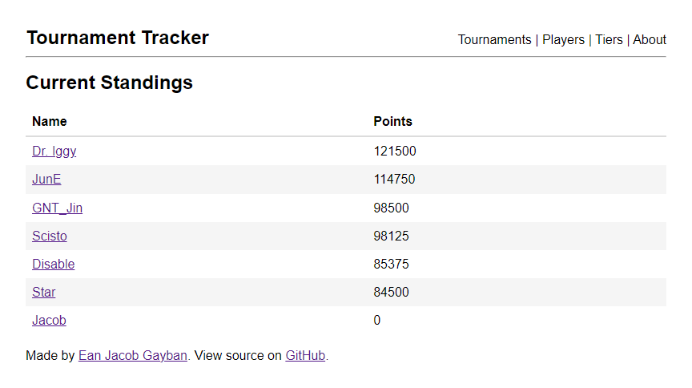
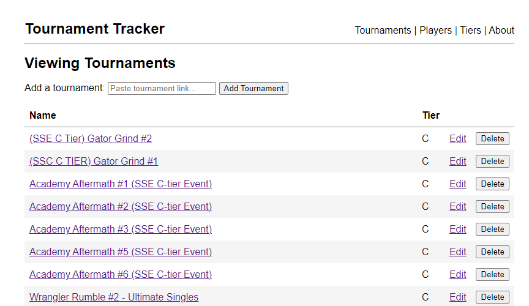
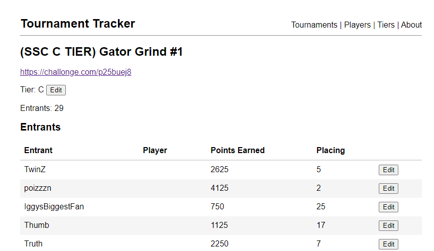
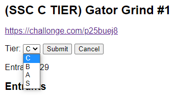
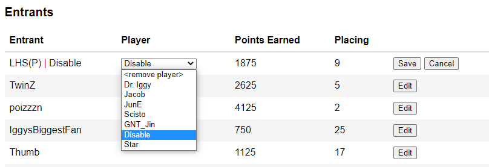
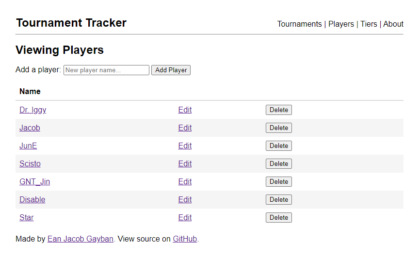
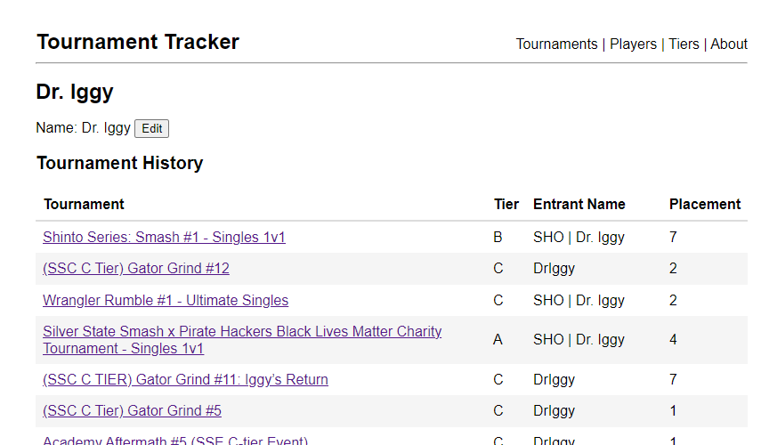
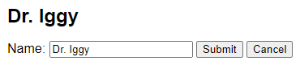
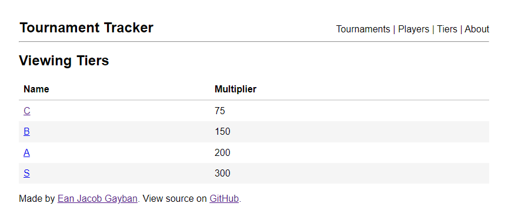
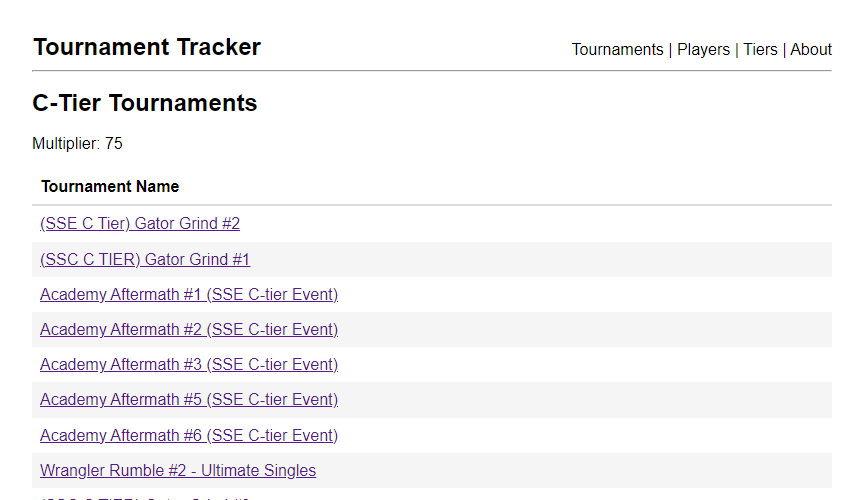

# Tourney Tracker

A rewrite of https://github.com/quincinia/pr-tracker using better practices. This program provides a simple user interface for tracking multiple players' performance across a series of tournaments. It includes a simple formula for quantifying how well a player did at a particular tournament, and uses these scores to determine a ranking of all the tracked players.

For further discussion on the development of this program, see its associated [blog post](https://ejacobg.com/projects/tourney-tracker/).

## Prerequisites

This program requires access to the Challonge and start.gg APIs. Generate a Challonge API key by creating an account and going to the [developer settings page](https://challonge.com/settings/developer). Take note of your Challonge username. Generate a start.gg API key by creating an account and going to the [developer settings page](https://start.gg/admin/profile/developer) as well.

This program makes use of the [golang-migrate/migrate](https://github.com/golang-migrate/migrate) tool. Find instructions for installing the CLI [here](https://github.com/golang-migrate/migrate/tree/master/cmd/migrate). The migration files currently provided assume a PostgreSQL database.

Once your API keys are generated and your database is set up, populate a `.envrc` file in the project root with these fields:

```shell
export TOURNEYTRACKER_DB_DSN='postgres://<username>:<password>@localhost/<database>?sslmode=disable'
export CHALLONGE_USER=...
export CHALLONGE_PASS=...
export STARTGG_KEY=...
```

## Usage

Use the `make db/migrations/up` command to create your database tables.

Use the `make run/tournaments` command to run the server using the DSN and credentials you provided above. If you wish to execute a binary, use the `-dsn`, `-challonge-user`, `-challonge-pass`, and `-startgg-key` command-line flags to pass in this data. The server will be hosted at http://localhost:4000.

All screenshots shown below can be found in the `screenshots/` directory.

### Homepage

The homepage displays all tracked players and their accumulated points, in descending order.



### Tournaments

The tournaments page shows all tracked tournaments, as well as an input box to paste tournament links. Currently, this program only supports Challonge and start.gg tournament links.



Clicking on a tournament will show all of its entrants. Clicking on the `Edit` buttons will return a form for editing each row, or the tournament's tier.





A player may be assigned to at most 1 entrant in a tournament.



### Players

The players page shows all tracked players, as well as an input box for a new player name.



Clicking on a player will show their tournament history. Clicking the `Edit` button will return an input box for editing the player's name.





### Tiers

The tiers page shows all the current tiers. Right now, I consider the tiers to be static.



Clicking on a tier will show all of its tournaments.



### About

The about page explains the formula used to calculate player points. See the Formula section below for an explanation.

## Formula

There are 6 variables that go into the point formula:

- Points for each unique placement (`UP`)
    - For every round that you win, you get this amount of points.
    - Those in last place **do not** get these points.
    - Currently set to 5 points per placement.
- Points for attendance (`ATT`)
    - Currently set to 10 points for showing up.
- Points for 1st place (`FIRST`)
    - Currently set to 10 points for winning.
- Points for bracket reset (`BR`)
    - If the person in loser's side grands makes a bracket reset *but still gets second*, then they will be awarded these points.
    - Currently set to 5 points for a bracket reset.
- Tier multiplier (`TIER`)
    - More prestigious tournaments are worth more points. These are applied as a multiplier after the all of the above points have been distributed.
- Placement value (`PV`)
    - This value represents how far from last place you made it in the tournament. If you got last, then your placement value is 0. Every placement after that will increase the placement value by 1.
    - For an 8-man (double-elimination) tournament, the placings look like this:
        - 7, 7, 5, 5, 4, 3, 2, 1
    - There are 6 unique placings (7, 5, 4, 3, 2, 1). The placement values for each placement are as follows:
        - 7th = 0
        - 5th = 1
        - 4th = 2
        - 3rd = 3
        - 2nd = 4
        - 1st = 5
- Larger tournaments have more placements, and thus there is potential to earn a lot more points if you place high.

The final formula looks like this:

```
(UP * PV + ATT + FIRST? + BR?) * TIER
```

The `FIRST` and `BR` bonuses may not apply to all competitors.
